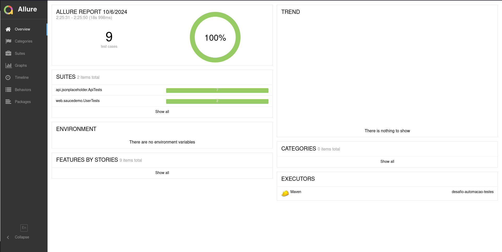

# Desafio Automação de Testes: RestAssured, Selenium e Appium 🧑‍💻
Este repositório contém testes automatizados para uma API usando RestAssured, um site web usando Selenium e uma seção para testes mobile usando Appium. Os testes foram configurados para gerar relatórios com o Allure Report.

## Testes de API 🛠️
Foi utilizada a biblioteca RestAssured para testar a API JSONPlaceholder ([Link da API](https://jsonplaceholder.typicode.com/)), especificamente o endpoint `/posts`.

### Funções Testadas:
- **Valida o código de status e o corpo da resposta do endpoint `/posts`**
- **Valida o título do primeiro post**
- **Valida a criação de um post no endpoint `/posts`**
- **Valida a atualização de um post existente no endpoint `/posts/{id}` com o método PUT**
- **Valida a atualização parcial de um post existente no endpoint `/posts/{id}` com o método PATCH**
- **Valida a ação de apagar um post específico no endpoint `/posts`**
- **Valida a resposta de erro ao tentar obter um post que não existe**

### Desafio Proposto:
#### Desafio API
Por favor, implemente as seguintes tarefas usando o recurso `/posts` da API JsonPlaceholder:

- Teste de API com Rest Assured:
  - Crie um cenário de teste para validar o código de resposta e o corpo da resposta da API `/posts` utilizando a biblioteca Rest Assured. O teste deve incluir verificações básicas, como a validação do status HTTP e a comparação de dados no corpo da resposta.

## Testes Web 🌐
Foi utilizada a biblioteca Selenium para automatizar testes no site SauceDemo ([Link do Site](https://www.saucedemo.com/)).
> OBS: O desafio inicial mencionava o teste web no site "Demo Autotesting" ([Link do Site](https://demo.automationtesting.in/Index.html)). No entanto, devido a problemas no formulário do site e a impossibilidade de finalizar o cadastro de usuários, optei por testar o SauceDemo.

### Funções Testadas:
- **Teste de Login, adição e remoção de itens no carrinho**
- **Teste de Login e Checkout dos itens adicionados ao carrinho**


### Métodos Auxiliares Criados:
- **Realizar login com username e senha**
- **Obter contagem de itens no carrinho**
- **Adicionar item no carrinho**
- **Remove item do carrinho**
- **Acessar o carrinho**
- **Realiza checkout**

### Desafio Proposto:
#### Teste Web usando Selenium:

- Crie um cenário de teste que abra um navegador, acesse o site de sua escolha, e valide algum comportamento da interface de usuário, como verificar a presença de um botão ou um campo de formulário.


## Testes Mobile 📱
"Não implementado".

## Instruções de Execução 🚀
### Instalação das Dependências
Para instalar todas as dependências do projeto, execute:
```
mvn clean install
```

### Execução dos Testes
Para rodar todos os testes, utilize o comando:
```
mvn clean test
```

### Gerar Relatórios Allure 📊
Os relatórios Allure são gerados tanto para os testes de API quanto para os testes Web. Nos testes Web, são feitas capturas de tela que podem ser vistas no relatório!


Para gerar e visualizar o relatório Allure, utilize o comando:

```
mvn allure:serve
```